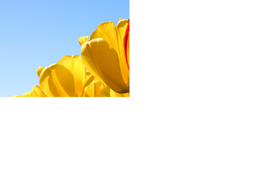
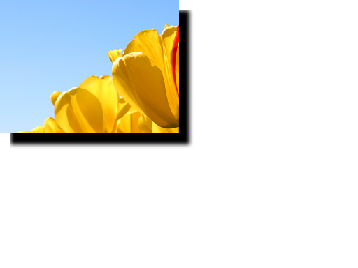

# Shadow effect

Use the shadow effect to generate a shadow from the alpha channel of an image. The shadow is more opaque for higher alpha values and more transparent for lower alpha values. You can set the amount of blur and the color of the shadow.

-   [Example image](#example-image)
-   [Effect properties](#effect-properties)
-   [Optimization modes](#optimization-modes)
-   [Output bitmap](#output-bitmap)
-   [Requirements](#requirements)
-   [Related topics](#related-topics)

The CLSID for this effect is CLSID\_D2D1Shadow.

## Example image

The example here shows the output of the shadow effect translated down and right with the source image composited over it in the original location. The shadow effect only outputs the shadow.


| Before                                                  |
|---------------------------------------------------------|
|       |
| After                                                   |
|  |


 


```C++
ComPtr<ID2D1Effect> shadowEffect;
m_d2dContext->CreateEffect(CLSID_D2D1Shadow, &shadowEffect);

shadowEffect->SetInput(0, bitmap);

// Shadow is composited on top of a white surface to show opacity.
ComPtr<ID2D1Effect> floodEffect;
m_d2dContext->CreateEffect(CLSID_D2D1Flood, &floodEffect);

floodEffect->SetValue(D2D1_FLOOD_PROP_COLOR, D2D1::Vector4F(1.0f, 1.0f, 1.0f, 1.0f));

ComPtr<ID2D1Effect> affineTransformEffect;
m_d2dContext->CreateEffect(CLSID_D2D12DAffineTransform, &affineTransformEffect);

affineTransformEffect->SetInputEffect(0, shadowEffect.Get());

D2D1_MATRIX_3X2_F matrix = D2D1::Matrix3x2F::Translation(20, 20));

affineTransformEffect->SetValue(D2D1_2DAFFINETRANSFORM_PROP_TRANSFORM_MATRIX, matrix);

ComPtr<ID2D1Effect> compositeEffect;
m_d2dContext->CreateEffect(CLSID_D2D1Composite, &compositeEffect);

compositeEffect->SetInputEffect(0, floodEffect.Get());
compositeEffect->SetInputEffect(1, affineTransformEffect.Get());
compositeEffect->SetInput(2, bitmap);

m_d2dContext->BeginDraw();
m_d2dContext->DrawImage(compositeEffect.Get());
m_d2dContext->EndDraw();
```


## Effect properties


| Display name and index enumeration                                                        | Description                                                                                                                                                                                                                                                                                                                                                                                                                  |
|-------------------------------------------------------------------------------------------|------------------------------------------------------------------------------------------------------------------------------------------------------------------------------------------------------------------------------------------------------------------------------------------------------------------------------------------------------------------------------------------------------------------------------|
| BlurStandardDeviation<br/> D2D1\_SHADOW\_PROP\_BLUR\_STANDARD\_DEVIATION<br/> | The amount of blur to be applied to the alpha channel of the image. You can compute the blur radius of the kernel by multiplying the standard deviation by 3. The units of both the standard deviation and blur radius are DIPs.<br/> This property is the same as the [Gaussian Blur](gaussian-blur.md) standard deviation property. <br/> The type is FLOAT.<br/> The default value is 3.0f.<br/> |
| Color<br/> D2D1\_SHADOW\_PROP\_COLOR<br/>                                     | The color of the drop shadow. This property is a D2D1\_VECTOR\_4F defined as: (R, G, B, A). You must specify this color in straight alpha.<br/> The type is D2D1\_VECTOR\_4F.<br/> The default value is {0.0f, 0.0f, 0.0f, 1.0f}.<br/>                                                                                                                                                                     |
| Optimization<br/> D2D1\_SHADOW\_PROP\_OPTIMIZATION<br/>                       | The level of performance optimization.<br/> The type is D2D1\_SHADOW\_OPTIMIZATION.<br/> The default value is D2D1\_SHADOW\_OPTIMIZATION\_BALANCED.<br/>                                                                                                                                                                                                                                                   |


 

## Optimization modes


| Name                                          | Description                                                                                                                           |
|-----------------------------------------------|---------------------------------------------------------------------------------------------------------------------------------------|
| D2D1\_DIRECTIONALBLUR\_OPTIMIZATION\_SPEED    | Applies internal optimizations such as pre-scaling at relatively small radii. Uses linear filtering.                                  |
| D2D1\_DIRECTIONALBLUR\_OPTIMIZATION\_BALANCED | Uses the same optimization thresholds as Speed mode, but uses trilinear filtering.                                                    |
| D2D1\_DIRECTIONALBLUR\_OPTIMIZATION\_QUALITY  | Only uses internal optimizations with large blur radii, where approximations are less likely to be visible. Uses trilinear filtering. |


 

## Output bitmap

The size of the output bitmap is the size of the blur output. The amount the output bitmap growth relative to the original bitmap can be calculated using the following equation:

Output Bitmap Growth (X and Y) = BlurStandardDeviation (device-independent pixels (DIPs))\*6\*(User DPI)/96

The output increases equally in all direction, so for example if the size increases by 10 pixels in each direction, the upper left corner of the bitmap is located at (-5, -5) and the lower right will be at (105, 105) as shown in the diagram here.


## Requirements


|                          |                                                                                    |
|--------------------------|------------------------------------------------------------------------------------|
| Minimum supported client | Windows 8 and Platform Update for Windows 7 \[desktop apps \| Windows Store apps\] |
| Minimum supported server | Windows 8 and Platform Update for Windows 7 \[desktop apps \| Windows Store apps\] |
| Header                   | d2d1effects.h                                                                      |
| Library                  | d2d1.lib, dxguid.lib                                                               |


 

## Related topics

<dl> <dt>

[**ID2D1Effect**](https://msdn.microsoft.com/en-us/library/Hh404566(v=VS.85).aspx)
</dt> </dl>

 

 


