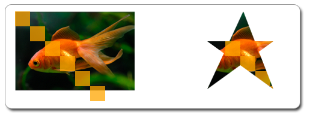

# How to Clip to a Geometric Mask

This topic describes how to use a geometric mask to clip a region of a layer.

**To clip a region with a geometric mask**

1.  Create the [**ID2D1Geometry**](https://msdn.microsoft.com/en-us/library/Dd316578(v=VS.85).aspx) that will be used to clip the region.
2.  Call [**ID2D1RenderTarget::CreateLayer**](/windows/desktop/api/d2d1/nf-d2d1-id2d1rendertarget-createlayer(id2d1layer)) to create a layer.
3.  Call [**ID2D1RenderTarget::PushLayer**](https://msdn.microsoft.com/en-us/library/Dd316869(v=VS.85).aspx) and pass the geometric mask you defined in step 1.
4.  Draw the content to clip.
5.  Call [**ID2D1RenderTarget::PopLayer**](https://msdn.microsoft.com/en-us/library/Dd316852(v=VS.85).aspx) to remove the layer from the render target.

The example that follows uses a geometric mask to clip an image and several rectangles. The following illustration shows the original bitmap on the left, and the bitmap clipped to the geometric mask on the right.



To clip the drawing as shown in the preceding illustration, you create an [**ID2D1PathGeometry**](https://msdn.microsoft.com/en-us/library/Dd371512(v=VS.85).aspx) and use it to define a star. The following code shows how to do this.


```C++
// Create the path geometry.
if (SUCCEEDED(hr))
{
    hr = m_pD2DFactory->CreatePathGeometry(&m_pPathGeometry);
}

// Write to the path geometry using the geometry sink to create a star.
if (SUCCEEDED(hr))
{
    hr = m_pPathGeometry->Open(&pSink);
}
if (SUCCEEDED(hr))
{
    pSink->SetFillMode(D2D1_FILL_MODE_WINDING);
    pSink->BeginFigure(D2D1::Point2F(20, 50), D2D1_FIGURE_BEGIN_FILLED);
    pSink->AddLine(D2D1::Point2F(130, 50));
    pSink->AddLine(D2D1::Point2F(20, 130));
    pSink->AddLine(D2D1::Point2F(80, 0));
    pSink->AddLine(D2D1::Point2F(130, 130));
    pSink->EndFigure(D2D1_FIGURE_END_CLOSED);

    hr = pSink->Close();
}

SafeRelease(&pSink);
```


Call [**CreateLayer**](/windows/desktop/api/d2d1/nf-d2d1-id2d1rendertarget-createlayer(id2d1layer)) to create a layer.

> [!Note]  
> Starting with Windows 8, you don't need to call [**CreateLayer**](/windows/desktop/api/d2d1/nf-d2d1-id2d1rendertarget-createlayer(id2d1layer)). In most situations performance is better if you don't call this method and Direct2D manages the layer resources.

 

Call [**PushLayer**](https://msdn.microsoft.com/en-us/library/Dd316869(v=VS.85).aspx) with the geometry mask to push the layer. Draw the content to clip, then call [**PopLayer**](https://msdn.microsoft.com/en-us/library/Dd316852(v=VS.85).aspx) to pop the layer. This produces the star-shaped drawing. The following code shows how to do this.


```C++
HRESULT DemoApp::RenderWithLayer(ID2D1RenderTarget *pRT)
{
    HRESULT hr = S_OK;

    // Create a layer.
    ID2D1Layer *pLayer = NULL;
    hr = pRT->CreateLayer(NULL, &pLayer);

    if (SUCCEEDED(hr))
    {
        pRT->SetTransform(D2D1::Matrix3x2F::Translation(350, 50));

        // Push the layer with the geometric mask.
        pRT->PushLayer(
            D2D1::LayerParameters(D2D1::InfiniteRect(), m_pPathGeometry),
            pLayer
            );
            
  
        pRT->DrawBitmap(m_pOrigBitmap, D2D1::RectF(0, 0, 200, 133));
        pRT->FillRectangle(D2D1::RectF(0.f, 0.f, 25.f, 25.f), m_pSolidColorBrush);  
        pRT->FillRectangle(D2D1::RectF(25.f, 25.f, 50.f, 50.f), m_pSolidColorBrush);
        pRT->FillRectangle(D2D1::RectF(50.f, 50.f, 75.f, 75.f), m_pSolidColorBrush); 
        pRT->FillRectangle(D2D1::RectF(75.f, 75.f, 100.f, 100.f), m_pSolidColorBrush);    
        pRT->FillRectangle(D2D1::RectF(100.f, 100.f, 125.f, 125.f), m_pSolidColorBrush); 
        pRT->FillRectangle(D2D1::RectF(125.f, 125.f, 150.f, 150.f), m_pSolidColorBrush);    
        

        pRT->PopLayer();
    }

    SafeRelease(&pLayer);

    return hr;
}
```


## Related topics

<dl> <dt>

[Layers Overview](direct2d-layers-overview.md)
</dt> <dt>

[Direct2D Reference](reference.md)
</dt> </dl>

 

 


