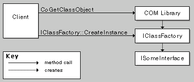
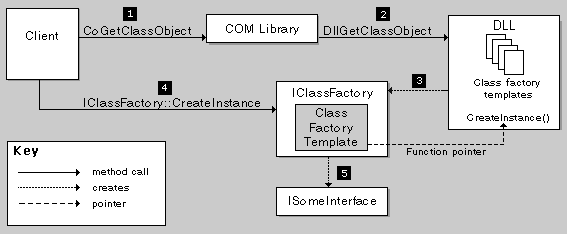

# Class Factories and Factory Templates

This topic describes how to implement a DLL for a DirectShow filter, using the [DirectShow Base Classes](directshow-base-classes.md).

Before a client creates an instance of a COM object, it creates an instance of the object's class factory, using a call to the [**CoGetClassObject**](https://docs.microsoft.com/windows/desktop/api/combaseapi/nf-combaseapi-cogetclassobject) function. The client then calls the class factory's **IClassFactory::CreateInstance** method. It is the class factory that actually creates the component and returns a pointer to the requested interface. (The [**CoCreateInstance**](https://docs.microsoft.com/windows/desktop/api/combaseapi/nf-combaseapi-cocreateinstance) function combines these steps, inside the function call.)

The following illustration shows the sequence of method calls.

[**CoGetClassObject**](https://docs.microsoft.com/windows/desktop/api/combaseapi/nf-combaseapi-cogetclassobject) calls the [**DllGetClassObject**](https://docs.microsoft.com/windows/desktop/api/combaseapi/nf-combaseapi-dllgetclassobject) function, which is defined in the DLL. This function creates the class factory and returns a pointer to an interface on the class factory. DirectShow implements **DllGetClassObject** for you, but the function relies on your code in a specific way. To understand how it works, you must understand how DirectShow implements class factories.

A class factory is a COM object dedicated to creating another COM object. Each class factory has one type of object that it creates. In DirectShow, every class factory is an instance of the same C++ class, **CClassFactory**. Class factories are specialized by means of another class, [**CFactoryTemplate**](cfactorytemplate.md), also called the *factory template*. Each class factory holds a pointer to a factory template. The factory template contains information about a specific component, such as the component's class identifier (CLSID), and a pointer to a function that creates the component.

The DLL declares a global array of factory templates, one for each component in the DLL. When [**DllGetClassObject**](https://docs.microsoft.com/windows/desktop/api/combaseapi/nf-combaseapi-dllgetclassobject) makes a new class factory, it searches the array for a template with a matching CLSID. Assuming it finds one, it creates a class factory that holds a pointer to the matching template. When the client calls **IClassFactory::CreateInstance**, the class factory calls the instantiation function defined in the template.

The following illustration shows the sequence of method calls.

The benefit of this architecture is that you can define just a few things that are specific to your component, such as the instantiation function, without implementing the entire class factory.

## Related topics

<dl> <dt>

[How to Create a DirectShow Filter DLL](how-to-create-a-dll.md)
</dt> </dl>

 

 

