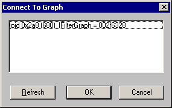

# Loading a Graph From an External Process

GraphEdit can load a filter graph created by an external process. With this feature, you can see exactly what filter graph your application builds, with only a minimal amount of additional code in your application.

> [!Note]  
> This feature requires Windows 2000, Windows XP, or later.

 

> [!Note]  
> Starting in Windows Vista, you must register proppage.dll to enable this feature. Proppage.dll is included in the Windows SDK.

 

The application must register the filter graph instance in the Running Object Table (ROT). The ROT is a globally accessible look-up table that keeps track of running objects. Objects are registered in the ROT by moniker. To connect to the graph, GraphEdit searches the ROT for monikers whose display name matches a particular format:


```C++
!FilterGraph X pid Y
```


where *X* is the hexadecimal address of the Filter Graph Manager, and *Y* is the process id, also in hexadecimal.

When your application first creates the filter graph, call the following function:


```C++
HRESULT AddToRot(IUnknown *pUnkGraph, DWORD *pdwRegister) 
{
    IMoniker * pMoniker = NULL;
    IRunningObjectTable *pROT = NULL;

    if (FAILED(GetRunningObjectTable(0, &pROT))) 
    {
        return E_FAIL;
    }
    
    const size_t STRING_LENGTH = 256;

    WCHAR wsz[STRING_LENGTH];
 
   StringCchPrintfW(
        wsz, STRING_LENGTH, 
        L"FilterGraph %08x pid %08x", 
        (DWORD_PTR)pUnkGraph, 
        GetCurrentProcessId()
        );
    
    HRESULT hr = CreateItemMoniker(L"!", wsz, &pMoniker);
    if (SUCCEEDED(hr)) 
    {
        hr = pROT->Register(ROTFLAGS_REGISTRATIONKEEPSALIVE, pUnkGraph,
            pMoniker, pdwRegister);
        pMoniker->Release();
    }
    pROT->Release();
    
    return hr;
}
```


This function creates a moniker and a new ROT entry for the filter graph. The first parameter is a pointer to the filter graph. The second parameter receives a value that identifies the new ROT entry. Before the application releases the filter graph, call the following function to remove the ROT entry. The *pdwRegister* parameter is the identifier returned by the AddToRot function.


```C++
void RemoveFromRot(DWORD pdwRegister)
{
    IRunningObjectTable *pROT;
    if (SUCCEEDED(GetRunningObjectTable(0, &pROT))) {
        pROT->Revoke(pdwRegister);
        pROT->Release();
    }
}
```


The following code example shows how to call these functions. In this example, the code that adds and removes ROT entries is conditionally compiled, so that it is included only in debug builds.


```C++
IGraphBuilder *pGraph;
DWORD dwRegister;
    
// Create the filter graph manager.
CoCreateInstance(CLSID_FilterGraph, NULL, CLSCTX_INPROC_SERVER,
                        IID_IGraphBuilder, (void **)&pGraph);
#ifdef _DEBUG
hr = AddToRot(pGraph, &dwRegister);
#endif

// Rest of the application (not shown).

#ifdef _DEBUG
RemoveFromRot(dwRegister);
#endif
pGraph->Release();
```


To view the filter graph in GraphEdit, run your application and GraphEdit at the same time. In the GraphEdit **File** menu, click **Connect to Remote Graph...** In the **Connect To Graph** dialog box, select the process id (pid) of your application and click **OK**. GraphEdit loads the filter graph and displays it. Don't use any other GraphEdit features on this graph—it might cause unexpected results. For example, don't add or remove filters, or stop and start the graph. Close GraphEdit before exiting your application.

> [!Note]  
> Your application might hit various asserts when it exits. You can ignore these.

 

The following illustration shows the **Connect To Graph** dialog box.



When GraphEdit loads the graph, it executes in the context of the target application. Therefore, GraphEdit might block because it is waiting for the thread. For example, this can occur if you are stepping through your code in the debugger.

This feature should be used only in debug builds of your application, not retail builds, because it enables other applications to view or control the filter graph.

## Connecting to a Remote Graph from the Command Line

GraphEdit supports a command-line option to load a remote graph automatically on startup. The syntax is:


```C++
GraphEdt -a moniker
```


where *moniker* is a moniker created using the AddToRot function, described previously.

## Related topics

<dl> <dt>

[Simulating Graph Building with GraphEdit](simulating-graph-building-with-graphedit.md)
</dt> </dl>

 

 


