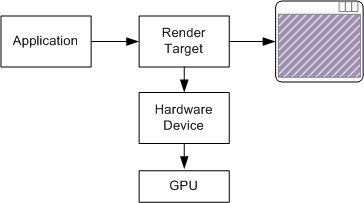

# Render Targets, Devices, and Resources

A *render target* is simply the location where your program will draw. Typically, the render target is a window (specifically, the client area of the window). It could also be a bitmap in memory that is not displayed. A render target is represented by the [**ID2D1RenderTarget**](https://docs.microsoft.com/windows/desktop/api/d2d1/nn-d2d1-id2d1rendertarget) interface.

A *device* is an abstraction that represents whatever actually draws the pixels. A hardware device uses the GPU for faster performance, whereas a software device uses the CPU. The application does not create the device. Instead, the device is created implicitly when the application creates the render target. Each render target is associated with a particular device, either hardware or software.



A *resource* is an object that the program uses for drawing. Here are some examples of resources that are defined in Direct2D:

-   **Brush**. Controls how lines and regions are painted. Brush types include solid-color brushes and gradiant brushes.
-   **Stroke style**. Controls the appearance of a line—for example, dashed or solid.
-   **Geometry**. Represents a collection of lines and curves.
-   **Mesh**. A shape formed out of triangles. Mesh data can be consumed directly by the GPU, unlike geometry data, which must be converted before rendering.

Render targets are also considered a type of resource.

Some resources benefit from hardware acceleration. A resource of this type is always associated with a particular device, either hardware (GPU) or software (CPU). This type of resource is called *device-dependent*. Brushes and meshes are examples of device-dependent resources. If the device becomes unavailable, the resource must be re-created for a new device.

Other resources are kept in CPU memory, regardless of what device is used. These resources are *device-independent*, because they are not associated with a particular device. It is not necessary to re-create device-independent resources when the device changes. Stroke styles and geometries are device-independent resources.

The MSDN documentation for each resource states whether the resource is device-dependent or device-independent. Every resource type is represented by an interface that derives from [**ID2D1Resource**](https://docs.microsoft.com/windows/desktop/api/d2d1/nn-d2d1-id2d1resource). For example, brushes are represented by the [**ID2D1Brush**](https://docs.microsoft.com/windows/desktop/api/d2d1/nn-d2d1-id2d1brush) interface.

## The Direct2D Factory Object

The first step when using Direct2D is to create an instance of the Direct2D factory object. In computer programming, a *factory* is an object that creates other objects. The Direct2D factory creates the following types of objects:

-   Render targets.
-   Device-independent resources, such as stroke styles and geometries.

Device-dependent resources, such as brushes and bitmaps, are created by the render target object.


To create the Direct2D factory object, call the [**D2D1CreateFactory**](https://docs.microsoft.com/windows/desktop/api/d2d1/nf-d2d1-d2d1createfactory) function.


```C++
ID2D1Factory *pFactory = NULL;

HRESULT hr = D2D1CreateFactory(D2D1_FACTORY_TYPE_SINGLE_THREADED, &pFactory);
```


The first parameter is a flag that specifies creation options. The **D2D1\_FACTORY\_TYPE\_SINGLE\_THREADED** flag means that you will not call Direct2D from multiple threads. To support calls from multiple threads, specify **D2D1\_FACTORY\_TYPE\_MULTI\_THREADED**. If your program uses a single thread to call into Direct2D, the single-threaded option is more efficient.

The second parameter to the [**D2D1CreateFactory**](https://docs.microsoft.com/windows/desktop/api/d2d1/nf-d2d1-d2d1createfactory) function receives a pointer to the [**ID2D1Factory**](https://docs.microsoft.com/windows/desktop/api/d2d1/nn-d2d1-id2d1factory) interface.

You should create the Direct2D factory object before the first [**WM\_PAINT**](https://docs.microsoft.com/windows/desktop/gdi/wm-paint) message. The [**WM\_CREATE**](https://docs.microsoft.com/windows/desktop/winmsg/wm-create) message handler is a good place to create the factory:


```C++
    case WM_CREATE:
        if (FAILED(D2D1CreateFactory(
                D2D1_FACTORY_TYPE_SINGLE_THREADED, &pFactory)))
        {
            return -1;  // Fail CreateWindowEx.
        }
        return 0;
```


## Creating Direct2D Resources

The Circle program uses the following device-dependent resources:

-   A render target that is associated with the application window.
-   A solid-color brush to paint the circle.

Each of these resources is represented by a COM interface:

-   The [**ID2D1HwndRenderTarget**](https://docs.microsoft.com/windows/desktop/api/d2d1/nn-d2d1-id2d1hwndrendertarget) interface represents the render target.
-   The [**ID2D1SolidColorBrush**](https://docs.microsoft.com/windows/desktop/api/d2d1/nn-d2d1-id2d1solidcolorbrush) interface represents the brush.

The Circle program stores pointers to these interfaces as member variables of the `MainWindow` class:


```C++
ID2D1HwndRenderTarget   *pRenderTarget;
ID2D1SolidColorBrush    *pBrush;
```


The following code creates these two resources.


```C++
HRESULT MainWindow::CreateGraphicsResources()
{
    HRESULT hr = S_OK;
    if (pRenderTarget == NULL)
    {
        RECT rc;
        GetClientRect(m_hwnd, &rc);

        D2D1_SIZE_U size = D2D1::SizeU(rc.right, rc.bottom);

        hr = pFactory->CreateHwndRenderTarget(
            D2D1::RenderTargetProperties(),
            D2D1::HwndRenderTargetProperties(m_hwnd, size),
            &pRenderTarget);

        if (SUCCEEDED(hr))
        {
            const D2D1_COLOR_F color = D2D1::ColorF(1.0f, 1.0f, 0);
            hr = pRenderTarget->CreateSolidColorBrush(color, &pBrush);

            if (SUCCEEDED(hr))
            {
                CalculateLayout();
            }
        }
    }
    return hr;
}
```


To create a render target for a window, call the [**ID2D1Factory::CreateHwndRenderTarget**](https://docs.microsoft.com/windows/desktop/api/d2d1/nf-d2d1-createhwndrendertarget) method on the Direct2D factory.

-   The first parameter specifies options that are common to any type of render target. Here, we pass in default options by calling the helper function [**D2D1::RenderTargetProperties**](https://docs.microsoft.com/windows/desktop/api/d2d1helper/nf-d2d1helper-rendertargetproperties).
-   The second parameter specifies the handle to the window plus the size of the render target, in pixels.
-   The third parameter receives an [**ID2D1HwndRenderTarget**](https://docs.microsoft.com/windows/desktop/api/d2d1/nn-d2d1-id2d1hwndrendertarget) pointer.

To create the solid-color brush, call the [**ID2D1RenderTarget::CreateSolidColorBrush**](https://docs.microsoft.com/windows/desktop/api/d2d1/nf-d2d1-createsolidcolorbrush) method on the render target. The color is given as a [**D2D1\_COLOR\_F**](https://docs.microsoft.com/windows/desktop/Direct2D/d2d1-color-f) value. For more information about colors in Direct2D, see [Using Color in Direct2D](using-color-in-direct2d.md).

Also, notice that if the render target already exists, the `CreateGraphicsResources` method returns **S\_OK** without doing anything. The reason for this design will become clear in the next topic.

## Next

[Drawing with Direct2D](drawing-with-direct2d.md)

 

 


