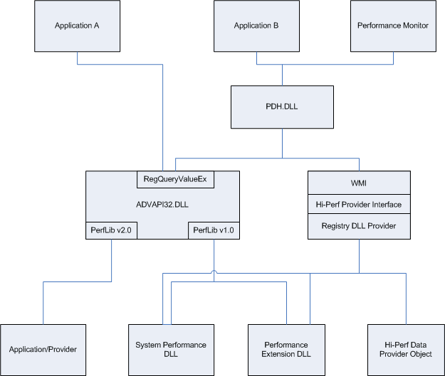

# About Performance Counters

Counters are used to provide information as to how well the operating system or an application, service, or driver is performing. The counter data can help determine system bottlenecks and fine-tune system and application performance. The operating system, network, and devices provide counter data that an application can consume to provide users with a graphical view of how well the system is performing.

Applications can also use counter data to determine how much system resources to consume. For example, an application that transfers data over the network could consume counter data from an internet gateway device (IGD) to determine how much data to transfer without competing for network bandwidth with other network traffic. The application could use the counter data to adjust its transfer rate as the bandwidth usage from other network traffic increase or decreases.

Consumers of counter data can consume counter data in real time or from log files. Real time data describes the current activity of the computer.

The following diagram illustrates how consumers, the registry, PDH, and performance DLLs and application providers work together.

Consumer A uses the registry interface to obtain counter information. Consumer B and the Performance Monitor use PDH to obtain counter information. In turn, the PDH functions can use either the registry interface or WMI.

For more information on creating and using WMI providers, see the [WMI SDK documentation](https://docs.microsoft.com/windows/desktop/WmiSdk/monitoring-performance-data).

 

 

