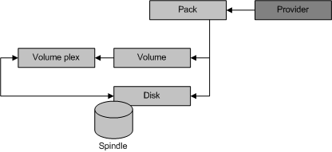

# Software Provider Objects

\[Beginning with Windows 8 and Windows Server 2012, the [Virtual Disk Service](virtual-disk-service-portal.md) COM interface is superseded by the [Windows Storage Management API](https://docs.microsoft.com/previous-versions/windows/desktop/stormgmt/windows-storage-management-api-portal).\]

Software provider objects model physical devices, such as IDE disks and CD-ROMs, and virtual elements like packs, volumes, and volume plexes. The following illustration shows the relationship between the provider object and the set of software provider objects, as well as the relationship between the various software provider objects themselves.

A provider object can contain zero or more packs. A pack object can contain zero or more disks and volumes. A volume comprises of at least one volume plex and each volume plex can map to one or more disks, depending on the plex type. VDS manages unallocated disks directly, without a pack container. The remaining topics of this section describe the pack, disk, volume, and volume plex objects.

## Related topics

<dl> <dt>

[VDS Object Model](vds-object-model.md)
</dt> </dl>

 

 

