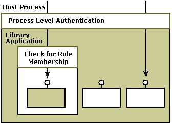
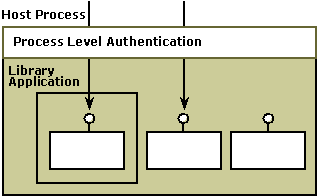
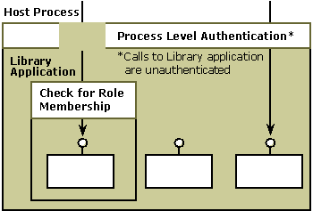
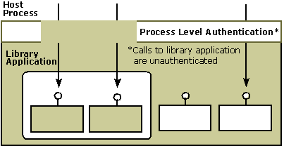

# Configuring Security for Library Applications

There are special considerations in configuring role-based security and authentication for library applications.

## Enabling or Disabling Authentication

One of the factors to consider is whether callers of the library application should be subject to the process-level security checks of the hosting process—that is, whether to enable or disable authentication.

For example, if the library application will be hosted by a browser, it might need to receive unauthenticated callbacks. To address this need, you can disable authentication so that the hosting process does not perform security checks for callers of the library application. When you disable authentication, the library application effectively goes unauthenticated—all calls to it will succeed. Callers of the library application are not subject to the security checks of the hosting process. Basically, the library application is tagged as "unauthenticated", and security checks are omitted for calls to the library application.

For information about how to enable or disable authentication, see [Enabling Authentication for a Library Application](enabling-authentication-for-a-library-application.md).

## Enforcing Role Checks

Another decision to make is whether the library application should use [role-based security](role-based-security-administration.md). If role-based security is used, you must be using component-level security for any access checks to be carried out. The roles assigned to the library application are not reflected in the process security descriptor. The only authorization that the library application can control is at the component level. For more information about component-level security, see [Security Boundaries](security-boundaries.md).

To see how to set component-level security, see [Setting a Security Level for Access Checks](setting-a-security-level-for-access-checks.md).

## Configuration Scenarios

To better understand the implications of deciding whether the library application should use role-based security and whether the library application should be unauthenticated, consider the following scenarios:

-   **Authentication is enabled, and role-based security is used.** In this scenario, security checks are made by the hosting process and some callers are denied access at the process level. Also, role checking is done at the library application level so that some callers who make it through the process-level security check are denied access to the library application when role membership is checked. This is the usual scenario for a COM+ library application that uses role-based security.

    The following illustration shows the scenario where authentication is enabled and role checking is used.

    

-   **Authentication is enabled, and role-based security is not used.** In this scenario, security checks are done at the process level but role membership is not checked at the library application level. Therefore, any caller of the library application that makes it through the process-level security check will be given access to the library application because role membership is not being checked. This situation would exist when a COM application that doesn't use role-based security is migrated to a COM+ library application.

    The following illustration shows the scenario where authentication is enabled and role checking is not being used.

    

-   **Authentication is disabled, and role-based security is used.** In this scenario, security checks are being done at the process level but callers to the library application are unauthenticated. In effect, callers of the library application are exempt from the process-level security check. Because role checking is enabled, role membership alone determines who is given access to the library application. This scenario might be appropriate when the security check that would be done by the hosting process is too restrictive but you need to have some access restriction on the library application or on specific interfaces or methods. This scenario enables you to effectively turn off process security and still have an appropriate level access checks using role-based security.

    The scenario where authentication is disabled and role checking is being used is shown in the following illustration.

    

-   **Authentication is disabled, and role-based security is not used.** In this scenario, security checks are still done at the process level but, as in the preceding scenario, callers of the library application always pass this security check. Because role checking is also disabled, role membership is not checked at the library application level. Essentially, anyone can call the library application. This scenario should be chosen when your COM object needs to receive unauthenticated callbacks, as might be the case with an ActiveX control hosted by Internet Explorer and with a Microsoft Management Console snap-in. Of course, this COM object must be trusted to behave appropriately when receiving unauthenticated calls. For example, it should not access arbitrary files on behalf of its callers.

    The scenario where authentication is disabled and role checking is not being used is shown in the following illustration.

    

After you have decided whether to enable or disable authentication for your COM+ library application, see [Enabling Authentication for a Library Application](enabling-authentication-for-a-library-application.md) for a step-by-step procedure that explains how to disable (or enable) authentication using the Component Services administrative tool. If your library application will use role-based security, see [Configuring Role-Based Security](configuring-role-based-security.md).

## Related topics

<dl> <dt>

[Library Application Security](library-application-security.md)
</dt> </dl>

 

 

