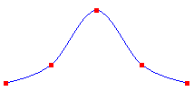

# Drawing Cardinal Splines

A cardinal spline is a curve that passes smoothly through a given set of points. To draw a cardinal spline, create a [**Graphics**](/windows/desktop/api/gdiplusgraphics/nl-gdiplusgraphics-graphics) object and pass the address of an array of points to the [**Graphics::DrawCurve**](https://msdn.microsoft.com/en-us/library/ms536070(v=VS.85).aspx) method. The following example draws a bell-shaped cardinal spline that passes through five designated points:


```
Point points[] = {Point(0, 100),
                  Point(50, 80),
                  Point(100, 20),
                  Point(150, 80),
                  Point(200, 100)};

Pen pen(Color(255, 0, 0, 255));
graphics.DrawCurve(&pen, points, 5);
```


The following illustration shows the curve and five points.



You can use the [**Graphics::DrawClosedCurve**](https://msdn.microsoft.com/en-us/library/ms536143(v=VS.85).aspx) method of the [**Graphics**](/windows/desktop/api/gdiplusgraphics/nl-gdiplusgraphics-graphics) class to draw a closed cardinal spline. In a closed cardinal spline, the curve continues through the last point in the array and connects with the first point in the array.

The following example draws a closed cardinal spline that passes through six designated points.


```
Point points[] = {Point(60, 60),
   Point(150, 80),
   Point(200, 40),
   Point(180, 120),
   Point(120, 100),
   Point(80, 160)};

Pen pen(Color(255, 0, 0, 255));
graphics.DrawClosedCurve(&pen, points, 6);
```


The following illustration shows the closed spline along with the six points:


You can change the way a cardinal spline bends by passing a tension argument to the [**Graphics::DrawCurve**](https://msdn.microsoft.com/en-us/library/ms536070(v=VS.85).aspx) method. The following example draws three cardinal splines that pass through the same set of points:


```
Point points[] = {Point(20, 50),
                  Point(100, 10),
                  Point(200, 100),
                  Point(300, 50),
                  Point(400, 80)};

Pen pen(Color(255, 0, 0, 255));
graphics.DrawCurve(&pen, points, 5, 0.0f);  // tension 0.0
graphics.DrawCurve(&pen, points, 5, 0.6f);  // tension 0.6
graphics.DrawCurve(&pen, points, 5, 1.0f);  // tension 1.0
```


The following illustration shows the three splines along with their tension values. Note that when the tension is 0, the points are connected by straight lines.


 

 


