# Property Windows

Property window is the collective name for the following types of user interfaces (UIs):

-   Property sheet: used to **view and change properties for an object or collection of objects in a dialog box**.
-   Property inspector: used to **view and change properties for an object or collection of objects in a pane**.
-   Options dialog box: used to **view and change options for an application**.

A property for an object is either of the following:

-   A setting that users can change (such as a file's name and read-only attribute).
-   An attribute of an object that users cannot directly change (such as a file's size and creation date).

Unlike dialog boxes (other than options dialogs) and wizards, property windows typically support several tasks instead of a single task.

Property windows are usually organized into pages, which are accessed through tabs. Property windows are often associated with tabs (and vice versa), but **tabs are not essential to property windows**.

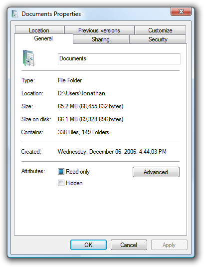

A typical property sheet.

**Note:** Guidelines related to [layout](vis-layout.md) and [tabs](ctrl-tabs.md) are presented in separate articles.

## Is this the right user interface?

To decide, consider these questions:

-   **Does setting the properties require users to perform a fixed, non-trivial sequence of steps?** If so, use a [wizard](win-wizards.md) or [task flow](glossary.md) instead.
-   **Is the content solely an application's options?** If so, use an options dialog box.
-   **Is the content solely an application's attributes?** If so, use an [About box](glossary.md).
-   **Is the content mostly an object's properties (its settings or attributes)?** If not, use a standard [dialog boxe](win-dialog-box.md) or [tabbed dialog box](glossary.md).
-   Are users **likely to view or change properties frequently or over an extended period of time?** If so, use a property inspector; otherwise, use a property sheet.
-   Are users **likely to view or change properties for several different objects at a time?** If so, use a property inspector; otherwise, use a property sheet.

**Property sheets and property inspectors aren't exclusive.** You can display the most frequently accessed properties in a property inspector, and the complete set in the property sheet.

## Design concepts

**Property windows often become a dumping ground for an odd assortment of low-level, technology-based settings.** Too often, these properties are organized into tabs, but beyond that not designed for any particular tasks or users. As a result, when users are faced with a task in a property window, they often don't know what to do.

To ensure that your property windows are useful and usable, follow these steps:

-   Make sure the properties are necessary.
-   Present properties in terms of user goals, not technology.
-   Present properties at the right level.
-   Design pages for specific tasks.
-   Design pages for specific users, especially limited users (non-administrators).
-   Organize the property pages efficiently.

**If you do only one thing...**

Present properties in terms of user goals, not technology. Pretend that you are explaining the property and why it is useful to a friend. How would you explain it? What language would you use? That's the language to use in your property pages.

## Usage patterns

Property windows have several usage patterns.

-   Property sheets. Properties for a single object are displayed in a modeless dialog box.
-   Multiple-object property sheets. Properties for multiple objects are displayed in a modeless dialog box.
-   Effective settings property sheets. The effective properties for a single object are displayed in a modeless dialog box.
-   Options dialog boxes. Properties for an application are displayed in a modal dialog box.
-   Property inspectors. Properties for the current selection (a single object or group of objects) are displayed in a modeless window pane or undocked window.

All property window patterns except property inspectors use a delayed commit, meaning that changes take effect only when users click OK or Apply. Property inspectors use an immediate commit (properties are changed as soon as users make changes), so there is no need for OK, Cancel, and Apply buttons.

## Guidelines

### Property sheets

-   **Display a property sheet when users:**
    -   Select the Properties command for an object.
    -   Set input focus on an object and press Alt+Enter.

**Multiple-object property sheets**

-   **Display the common properties of all the selected objects.** Where the property values differ, display the controls associated with those values using a mixed state. (See the respective control guidelines for using mixed-state values.)
-   If the selected object is a collection of multiple discrete objects (such as a file folder), **display the properties of the single grouped object instead of a multiple-object property sheet for the discrete objects.**

### Options dialog boxes

-   **Don't separate options from customization.** That is, don't have both an Options command and a Customize command. Users are often confused by this separation. Instead, access customization through options.

### Property pages

-   **Follow these guidelines for page order:**
    -   Make the General page or its equivalent the first page.
    -   Make the Advanced page or its equivalent the last page.
    -   For the remaining pages:
        -   Organize them into groups of related pages.
        -   Order the groups by the likelihood of their usage.
        -   Within each group, order the pages either by their relationships or by the likelihood of their use.
        -   You shouldn't have so many pages that there is a need to display them in alphabetical order.
-   **Make pages coherent by relating all properties on each page to a single, specific, task-based purpose.**
-   **If space allows, explain the purpose of the property window at the top of the page if it isn't obvious to your target users.** If the page is used to perform only a single task, **phrase the text as a clear instruction about how to perform that task**. Use complete sentences, ending with a period.

    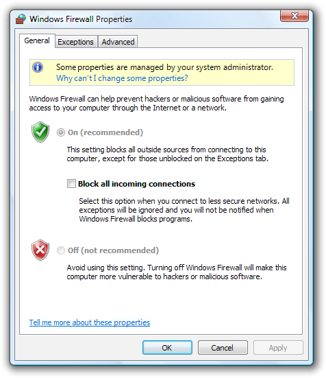

    In this example, the purpose of Microsoft Windows Firewall is explained at the top of the General page.

-   **Make similar content consistent across pages by using consistent control names and locations.** For example, if several pages have Name boxes, try to place them in the same location on the page and use consistent labels. Similar content shouldn't bounce around from page to page.
-   **Place the same property on the same page throughout your application.** For example, don't put an Expiration property on the General tab for one object type, and on the Advanced tab for another type.
-   **If users are likely to start with the last page displayed, make the page tab persist, and select it by default.** Make the settings persist on a per-property window, per-user basis. Otherwise, select the first page by default.
-   **Don't make the settings on a page dependent upon settings on other pages.** Put the dependent settings on a single page instead. Changing a setting on one page should never automatically change settings on other pages.
    -   **Exception:** If the dependent settings are in two different property windows, use static text labels to explain this relationship in both locations.
-   **Don't scroll property pages.** Both tabs and scrollbars are used to increase the effective area of a window, but one mechanism should be sufficient. Instead of using scrollbars, make the property pages larger and lay out the pages efficiently.

**First pages**

-   For object properties, **put the object's name on the first page.**
-   If you are associating (optional) [icons](vis-icons.md) with your objects, **display the appropriate icon in the upper-left corner** of the first page.

**General pages**

-   **Avoid General pages.** You aren't required to have a General page. Use a General page only if:
    -   The properties apply to several tasks and are meaningful to most users. Don't put specialized or advanced properties on a General page, but you can make them accessible through a command button on the General page.
    -   The properties don't fit a more specific category. If they do, use that name for the page instead.

**Advanced pages**

-   **Avoid Advanced pages.** Use an Advanced page only if:
    -   The properties apply to uncommon tasks and are meaningful primarily to advanced users.
    -   The properties don't fit a more specific category. If they do, use that name for the page instead.
-   **Don't call properties advanced based solely on technological measures.** For example, a printer stapling option may be an advanced printer feature, but it is meaningful to all users, so it shouldn't be on an Advanced page.

### Owned property windows

-   **Don't display more than one owned property window from a property window.** Displaying more than one makes the meaning of the OK and Cancel buttons difficult to understand. You can display other types of auxiliary dialog boxes (such as object pickers) as needed.

    **Incorrect:**

    

    In this example, the owner options dialog box has three levels of owned property windows. As a result, the meanings of OK and Cancel are confusing.

-   For property windows that use a delayed commit model, **make sure users can cancel changes made in an owned property window by clicking Cancel on the owner window.**
-   If an owned property window requires an immediate commit, **indicate that changes were committed by renaming the Cancel button on the owner window to Close.** Revert the button back to Cancel if the user clicks Apply.

    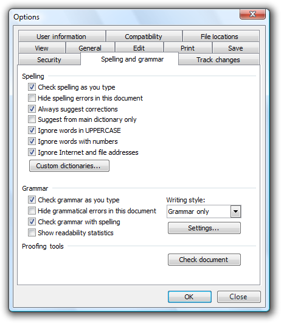

    In this example, changes to custom dictionaries and grammar settings can't be cancelled. You can give users this feedback by changing Cancel to Close.

**Other owned windows**

-   If an owned window is used to perform an auxiliary task, **don't rename the Cancel button.** The preceding guidelines apply only to owned property windows, not dialog boxes used to perform auxiliary tasks.

    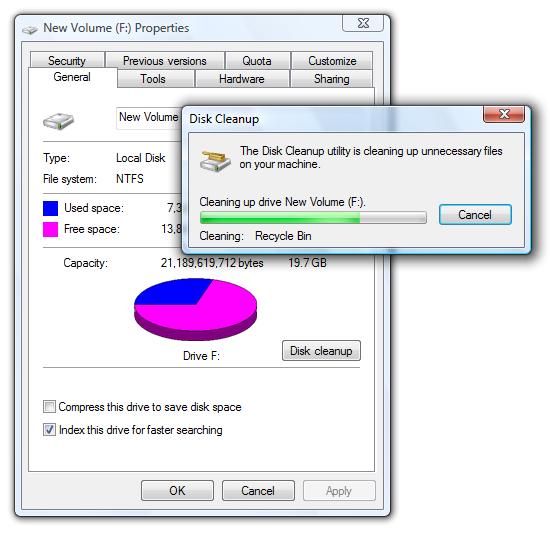

    In this example, Disk Cleanup is an auxiliary task, so the previous guidelines don't apply. For example, the Cancel button on the owner window shouldn't be changed to Close.

-   If the owned window is used to perform an auxiliary task, **don't close the owner property window when the command button is clicked.** Doing so is disorienting and assumes that the only reason the user displayed the property window was to perform that command.

    **Incorrect:**

    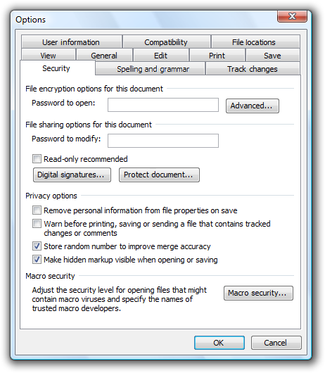

    In this example, clicking **Protect document** incorrectly closes the Options dialog box.

### Tabs

-   **Use concise tab labels.** Use one or two words that clearly describe the content of the page. Longer labels result in an inefficient use of screen space, especially when the labels are localized.
-   **Use specific, meaningful tab labels.** Avoid generic tab labels that could apply to any tab, such as General, Advanced, or Settings.
-   **Use horizontal tabs if:**
    -   The property window has seven or fewer tabs (including any third-party extensions).
    -   **All the tabs fit on one row, even when the UI is localized.**
    -   You use horizontal tabs on the other property windows in your application.
-   **Use vertical tabs if:**

    -   The property window has eight or more tabs (including any third-party extensions).
    -   **Using horizontal tabs would require more than one row.**
    -   You use vertical tabs on the other property windows in your application.

    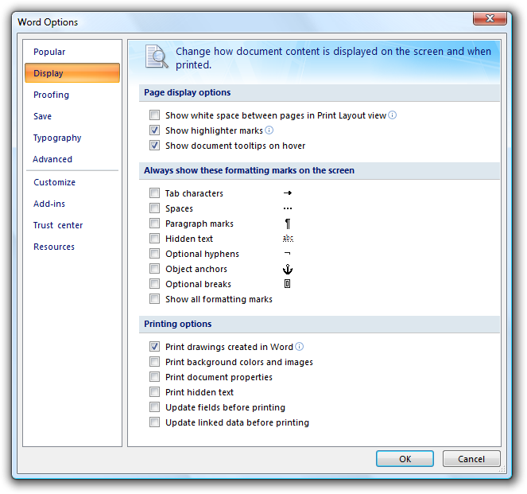

    In this example, vertical tabs are used to accommodate eight or more tabs.

-   **For property inspectors, to conserve space, consider using a drop-down list instead of tabs**, especially if the current tab is rarely changed by the user.
-   **If a tab doesn't apply to the current context and users don't expect it to, remove the tab.** Doing so simplifies the UI, and users won't miss it.

    **Incorrect:**

    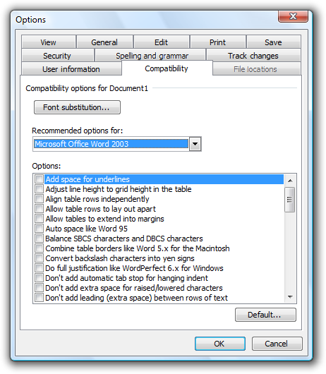

    In this example, the File Locations tab is incorrectly disabled when Microsoft Word 2003 is used as an e-mail editor. The page should be removed because users wouldn't expect to view or change file locations in this context.

-   **If a tab doesn't apply to the current context and users might expect it to:**

    -   **Display the tab.**
    -   **Disable the controls on the page.**
    -   **Include text explaining why the controls are disabled.**

    Don't disable the tab because doing so isn't self-explanatory and prohibits exploration. Furthermore, users looking for a specific property would be forced to look on all other tabs.

    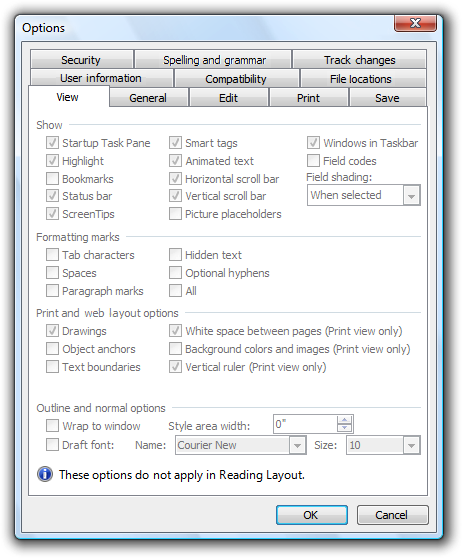

    In this example from Word 2003, none of the View options apply in Reading Layout. However, users might expect them to apply based on the tab label, so the page is displayed but the options are disabled.

-   **Don't assign effects to changing tabs.** Changing the current tab should never have side effects, apply settings, or result in an error message.
-   **Don't nest tabs or combine horizontal tabs with vertical tabs.** Instead, reduce the number of tabs, use only vertical tabs, or use another control such as a drop-down list.
-   **Don't use tabs if a property window has only a single tab and isn't extensible.** Use a regular dialog box with OK, Cancel, and an optional Apply button instead. Extensible property windows (which can be extended by third parties) always need to use tabs.
-   **Don't put icons on tabs.** Icons usually add unnecessary visual clutter, consume screen space, and often don't improve user comprehension. Only add icons that aid in comprehension, such as standard symbols.

    **Incorrect:**

    

    In this example, the graphics add unnecessary visual clutter and do little to improve user comprehension.

-   **Don't use product logos for tab graphics.** Tabs aren't for branding.
-   **Don't scroll horizontal tabs.** Horizontal scrolling isn't readily discoverable. You may scroll vertical tabs, however.

    **Incorrect:**

    

    In this example, the horizontal tabs are scrolled.

### Command buttons

-   **Place command buttons that apply to all property pages at the bottom of the property window.** Right-align the buttons and use this order (from left to right): OK, Cancel, and Apply.
-   **Place command buttons that apply only to individual property pages directly on the property page.**

### Commit buttons

**OK buttons**

-   **For owner property windows, the OK button means apply the pending changes (made since the window was opened or the last Apply), and close the window.**
-   **For owned property windows, the OK button means keep the changes, close the window, and apply the changes when the owner window's changes are applied.**
-   **Don't rename the OK button.** Unlike other dialog boxes, property windows aren't used to perform any one specific task. If it makes sense to rename the OK button (to Print, for example), the window isn't a property window.
-   **Don't assign an access key.**

**Cancel buttons**

-   **The Cancel button means discard all pending changes (made since the window was opened or the last Apply), and close the window.**
-   **If all pending changes can't be abandoned, rename the Cancel button to Close.** Clicking Cancel must abandon all pending changes.
-   **If the owned property window requires an immediate commit, rename the Cancel button on the owner window to Close to show that changes were committed.**
-   **Don't assign an access key.**

**Apply buttons**

-   **For owner property sheets, the Apply button means apply the pending changes (made since the window was opened or the last Apply), but leave the window open.** Doing so allows users to evaluate the changes before closing the property sheet.
-   **For owned property sheets, don't use.** Using an Apply button on an owned property sheet makes the meaning of the commit buttons on the owner property sheet difficult to understand.
-   **Provide an Apply button only if the property sheet has settings (at least one) with effects that users can evaluate in a meaningful way.** Typically, Apply buttons are used when settings make visible changes. Users should be able to apply a change, evaluate the change, and make further changes based on that evaluation. If not, remove the Apply button instead of disabling it.

    **Incorrect:**

    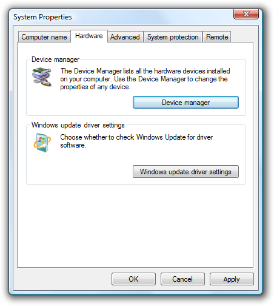

    In this example, none of the system properties have a visual effect, so the Apply button has no value and should be removed.

-   **Place all settings that users may want to apply on owner pages.** Don't use Apply buttons on owned property sheets, because doing so is confusing.
-   **Use Apply buttons only with property sheets, not with options dialog boxes.**
-   **Enable the Apply button only when there are pending changes**; otherwise, disable it.
-   **Assign "A" as the access key.**

**Close buttons**

-   **If all pending changes can't be abandoned, rename the Cancel button to Close.** Clicking Cancel must abandon all pending changes.
-   **Don't confirm if users discard their changes.**
    -   **Exception:** If the property window has settings that require significant effort to set and the user has made changes, you may display a [confirmation](mess-confirm.md) if the user clicks the Close button on the title bar. The reason is that some users mistakenly assume that the Close button on the title bar has the same effect as the OK button.
-   **With the exception of the confirmation message, make sure the Close button on the title bar has the same effect as Cancel or Close.**

### Page contents

-   **Make sure the properties are necessary.** Don't clutter your pages with unnecessary properties just to avoid making hard design decisions.
-   **Present properties in terms of user goals, not technology.** Just because a property configures a specific technology doesn't mean that you must present the property in terms of that technology.
    -   If you must present settings in terms of technology (perhaps because your users recognize the technology's name), include a brief description of how the user benefits from that setting.
-   **Present properties at the right level.** You don't need to present individual, low-level settings on a property page, so present the properties at a level that makes sense to your users.
-   **Design property pages for specific tasks.** Determine the tasks that users will perform, and make sure there is a clear path to perform those tasks.
-   **Organize property pages efficiently** by reducing the number of tabs, deciding what goes on a page based on logical grouping and coherence, and simplifying the page's presentation.

<!-- -->

-   **If an option is strongly recommended, consider adding "(recommended)" to the label.**
-   **Provide a Restore Defaults command button for a property page or the entire property window when:**

    -   Your users are likely to consider the settings complex and difficult to understand.
    -   Having incorrect settings may result in breaking functionality, but the defaults might restore functionality.
    -   It's easier for users to start over when the object is misconfigured.

    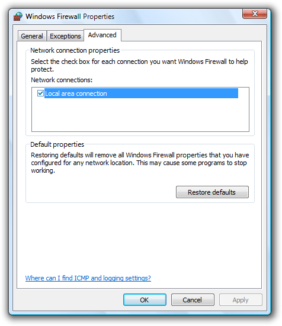

    In this example, the Windows Firewall settings are complex and may result in broken functionality. If there's a problem, it is often easier for users to start over by clicking Restore Defaults.

-   Confirm the Restore Defaults command if its effect isn't obvious or the settings are complex. Indicate the confirmation by using [ellipses](ctrl-command-buttons.md).
-   **When appropriate, display a preview of the results of a setting.**

    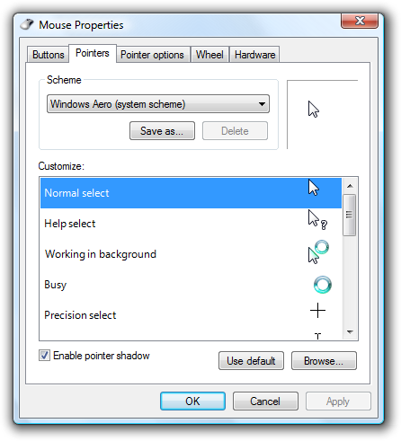

    In this example, the page displays a preview of the pointer schemes. While clicking Apply also shows a preview, having a preview on the page is more efficient for users.

    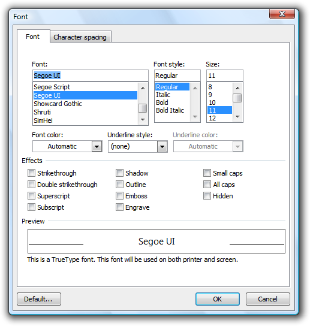

    In this example, the Preview box shows the results of the font settings. This example shows that you can preview settings that aren't graphical.

### Help

-   When providing user assistance, **consider using the following options** (listed in their order of preference):
    -   Give interactive controls self-explanatory labels. Users are more likely to read the labels on interactive controls than any other text.
    -   Provide in-context explanations using static text labels.
    -   Provide a specific [link](ctrl-links.md) to a relevant Help topic.
-   **Locate Help links at the bottom of each page.** If a page has several distinct groups of settings that have a Help topic (perhaps within group boxes), locate the Help link at the bottom of the group.
-   **Don't use general or vague Help topic links or generic Help buttons.** Users often ignore generic Help.

For more information and examples, see [Help](winenv-help.md).

### Standard users and Protected administrators

**Many settings require administrator privileges to change.** If a process requires administrator privileges, Windows and later requires [Standard users](glossary.md) and [Protected administrators](glossary.md) to elevate their privileges explicitly. Doing so helps prevent malicious code from running with administrator privileges.

For more information and examples, see [User Account Control](winenv-uac.md).

### Default values

-   **The settings within a property window must reflect the current state of the application, object, or collection of objects.** Doing otherwise would be misleading and possibly lead to undesired results. For example, if the settings reflect the recommendations but not the current state, users might click Cancel instead of making changes, thinking that no changes are needed.
-   **Choose the safest (to prevent loss of data or system access) and most secure initial state.** Assume that most users won't change the settings.
-   **If safety and security aren't factors, choose the initial state that is most likely or convenient.**

## Text

### Commands

-   To display program options, use "Options."
-   To display an object's property window, use "Properties."
-   To display a summary of the commonly used program customization settings, use "[Personalize](glossary.md)."
-   Don't use "Settings" or "Preferences."
-   Don't use [ellipses](ctrl-command-buttons.md) for these commands.

### Property sheet titles

-   For a single object, use "\[object name\] Properties."
    -   If the object has no name, use the object's type name. (For example, User Account Properties.)
-   For multiple objects, use "\[first object name\], ... Properties."
    -   If the objects have no names, use the objects' type name. (For example, User Accounts Properties.)
    -   If the objects have different types, use "Selection Properties."
-   Use [title-style capitalization](glossary.md).
-   Don't use ending punctuation.
-   Don't use hyphens, such as "\[object name\] - Properties."

### Property inspector titles

-   Use "Properties."
-   Use title-style capitalization.
-   Don't use ending punctuation.

### Options dialog box titles

-   Use "Options."
-   Use title-style capitalization.
-   Don't use ending punctuation.

### Property page tab names

-   **Use concise tab labels.** Use one or two words that clearly describe the content of the page. Using longer tab names results in an inefficient use of screen space, especially when the tab names are localized.
-   **Use specific, meaningful tab labels.** Avoid generic tab labels that could apply to any tab, such as General, Advanced, or Settings.
-   Write the label as a one- or two-word phrase and use no ending punctuation.
-   Use [sentence-style capitalization](glossary.md).
-   Don't assign a unique [access key](glossary.md).

### Property page text

-   Avoid large blocks of text.
-   Provide enough room for the text to expand 30 percent if it will be localized.
-   Don't use text phrased as a command on property windows. Because users might want to simply view settings, you don't want to prompt them to change settings.
-   Use sentence-style capitalization and ending punctuation.

## Documentation

When referring to property windows:

-   In programming and other technical documentation, refer to property sheets and options dialog boxes as property sheets. Everywhere else, use dialog box, especially in user documentation.
-   Use the exact title text, including its capitalization.
-   To describe user interaction, use open and close.
-   When possible, format the title using bold text. Otherwise, put the title in quotation marks only if required to prevent confusion.

When referring to property pages:

-   In programming and other technical documentation, refer to property pages as property pages. Everywhere else, use tab, especially in user documentation.
-   Use the exact title text, including its capitalization.
-   To describe user interaction, use click to refer to clicking a tab.
-   When possible, format the name using bold text. Otherwise, put the name in quotation marks only if required to prevent confusion.

 

 

