# Notification Area

The notification area provides notifications and status. Well-designed programs use the notification area appropriately, without being annoying or distracting.

The notification area is a portion of the taskbar that provides a temporary source for notifications and status. It can also be used to display icons for system and program features that have no presence on the desktop.

Items in the notification area are referred to as notification area icons, or simply icons if the context of the notification area is already clearly established.

The notification area.

To give users control of their desktop in Windows 7, not all notification area icons are displayed by default. Rather, icons are displayed in the notification area overflow unless promoted to the notification area by the user.

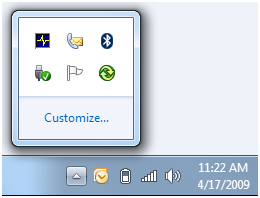

The notification area overflow.

**Note:** Guidelines related to the [taskbar](winenv-taskbar.md), [notifications](mess-notif.md) , and [balloons](ctrl-balloons.md) are presented in separate articles.

## Is this the right user interface?

To decide, consider these questions:

-   **Does your program need to display a notification?** If so, you must use a notification area icon.
-   **Is the icon displayed temporarily to show a change of status?** If so, a notification area icon may be appropriate, depending upon the following factors:

    -   **Is the status useful and relevant?** That is, are users likely to monitor the icon and change their behavior as a result of this information? If not, either don't display the status, or put it in a log file.

        **Incorrect:**

        

        In this example, the disk drive activity icon is inappropriate because users are unlikely to change their behavior based on it.

    -   **Is the status critical? Is immediate action required?** If so, display the information in a way that demands attention and cannot be easily ignored, such as a [dialog box](win-dialog-box.md).

    Programs designed for Windows 7 can use overlay icons on the program's taskbar button to show change of status, as well as taskbar button progress bars to show progress of long-running tasks.

-   **Does the feature already have "desktop presence"?** That is, when run, does the feature appear in a window on the desktop (possibly minimized)? If so, display status in the program's [status bar](ctrl-status-bars.md), other status area, or, for Windows 7, directly on the taskbar button. If the feature doesn't have desktop presence, you can use an icon for program access and to show status.
-   **Is the icon primarily to launch a program or access its features or settings quickly?** If so, use the Start menu to launch programs instead. The notification area isn't intended for quick program or command access.

    

    In this example from Windows Vista, Quick Launch is used to launch Windows Explorer and Windows Internet Explorer quickly.

    For programs designed for Windows 7, users can pin taskbar buttons for quick program access. Programs can use a Jump List or thumbnail toolbar to access frequently used commands directly from a program's toolbar button. The Quick Launch area isn't displayed by default in Windows 7.

    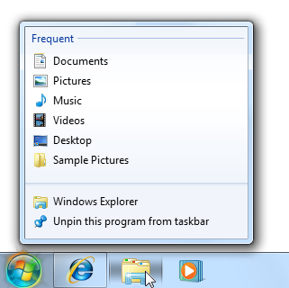

    In this example, a Jump List is used for quick command access.

## Design concepts

### The Windows desktop

The Windows desktop has the following program access points:

-   **Work area.** The onscreen area where users can perform their work, as well as store programs, documents, and their shortcuts. While technically the desktop includes the taskbar, in most contexts it refers just to the work area.
-   **Start button.** The access point for all programs and special Windows places (Documents, Pictures, Music, Games, Computer, Control Panel), with "most recently used" lists for quick access to recently used programs and documents.
-   **Quick Launch.** A direct access point for programs selected by the user. Quick Launch was removed from Windows 7.
-   **Taskbar.** The access point for running programs that have desktop presence. While technically the taskbar spans the entire bar from the Start button to the notification area, in most contexts taskbar refers to the area in between, containing the taskbar buttons. This area is sometimes referred to as the taskband.
-   **Deskbands. Not recommended.**
-   **Notification area.** A short-term source for notifications and status, as well as an access point for system- and program-related features that have no presence on the desktop.

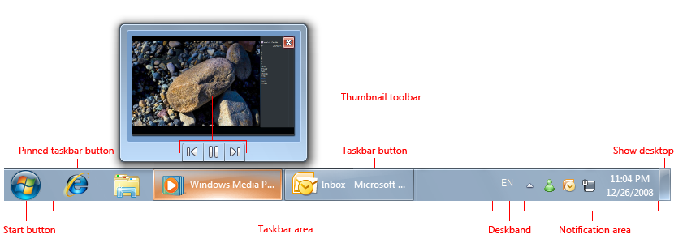

The Windows desktop access points include the Start button, taskbar, and notification area. Note the thumbnail feature of the taskbar button.

**The desktop is a limited, shared resource that is the user's entry point to Windows.** Leave users in control. You should use the desktop areas as intended any other usage should be considered an abuse. For example, never view desktop areas as ways to promote your program or its [Brand](exper-branding.md).

### Using the notification area appropriately

The notification area was originally intended as a temporary source for notifications and status. Its efficiency and convenience has encouraged developers to give it other purposes, such as launching programs and executing commands. Unfortunately over time, these additions made the notification area too large and noisy, and confused its purpose with the other desktop access points.

Windows XP addressed the scale problem by making the area collapsible and hiding the unused icons. Windows Vista addressed the noise by removing unnecessary, annoying notifications. Windows 7 has gone a step further by focusing the notification on its original purpose of being a notification source. **Most icons are hidden by default in Windows 7, but can be promoted to the notification area manually, by the user. To keep users in control of their desktops, there is no way for your program to perform this promotion automatically.** Windows still displays notifications for hidden icons by promoting them temporarily.

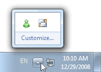

In Windows 7, most notification area icons are hidden by default.

In addition, Windows 7 supports many features directly in the taskbar buttons. Specifically, you can use:

-   Jump Lists and thumbnail toolbars to quickly access frequently used commands.
-   Overlay icons to show status for running programs.
-   Taskbar button progress bars to show progress for long-running tasks.

In short, if your program has desktop presence, take full advantage of the Windows 7 taskbar button features for these purposes. **Keep the notification area icons focused on displaying notifications and status.**

### Keeping users in control

Keeping users in control extends beyond using the notification area correctly. Depending on the nature of your icon, you may want to let users do the following:

-   **Remove the icon.** Your icon may provide relevant, useful status, but even so, users may not want to see it. Windows allows users to hide icons, but this feature isn't easily discoverable. To keep users in control, provide a **Display icon in notification area** option on the icon's context menu. Note that removing an icon doesn't have to affect the underlying program, feature, or process.
-   **Select types of notifications to display.** Your notification must be useful and relevant, but there may be notifications that users don't want to see. This is especially true for FYI [notifications](mess-notif.md). Let users choose to enable the less important ones.
-   **Suspend optional features.** Icons are used to display status for features without desktop presence. Such features tend to be long-running, optional background tasks, such as printing, indexing, scanning, or synchronizing. Users may want to suspend such features to increase system performance, reduce power consumption, or because they are offline.
-   **Quit the program.** Provide the more suitable of these options:
    -   **Temporarily quit program.** The program is stopped and restarted when Windows is restarted. This approach is suitable for important system utilities such as security programs.
    -   **Permanently quit program.** The program is stopped and not restarted when Windows is restarted (unless the user chooses to restart later). Either the user no longer wants to run the program, or wants to run the program on demand perhaps to improve system performance.

Although it's a good idea to provide most of these settings on the icon's context menu, the program's default experience should be suitable for most users. Don't turn everything on by default and expect users to turn features off. Rather, turn the important features on by default, and let users enable additional features as desired.

**If you do only four things...**

1.  Don't abuse the notification area. Use it only as a source for notifications and status, and for features without desktop presence.
2.  Keep users in control. Provide appropriate options to control the icon, its notifications, and the underlying features.
3.  Present a default experience that is suitable for most users. Let users enable desired features rather than expect them to disable undesired ones.
4.  Take full advantage of the Windows 7 taskbar button features to show status and make your program's most frequently performed tasks efficient.

## Usage patterns

Notification area icons have several usage patterns:

<table>
<colgroup>
<col style="width: 50%" />
<col style="width: 50%" />
</colgroup>
<tbody>
<tr class="odd">
<td><strong>System status and access</strong>  Displayed continuously to show important but not critical system status, and to provide access to relevant features and settings.  </td>
<td>System features that need notification area icons have no persistent desktop presence. Can also be used as a notification source.     In this example, the battery, network, and volume icons are displayed continuously when applicable. </td>
</tr>
<tr class="even">
<td><strong>Background task status and access</strong>  Displayed while a background task is running to show status and provide access to features and settings.  </td>
<td>Background processes need notification area icons when they have no desktop presence. Can also be used as a notification source.     In this example, the Action Center icon allows users to check its status even when it has no desktop presence. </td>
</tr>
<tr class="odd">
<td><strong>Temporary event status</strong>  Programs with desktop presence can display icons temporarily to show important events or changes in status.  </td>
<td>  In this example, icons for printing and installing updates are displayed temporarily to show important events or changes in status. </td>
</tr>
<tr class="even">
<td><strong>Temporary notification source</strong>  Displayed temporarily to show a notification. Removed after a timeout, or when the underlying problem is addressed or task performed.  </td>
<td>Temporary icons are preferred for pure notification sources. Don't display an icon that doesn't provide useful, relevant, dynamic status just because a feature might need to display a notification in the future.     In this example, the plug-and-play icon is displayed while a new hardware detected notification is shown. </td>
</tr>
<tr class="odd">
<td><strong>Minimized single-instance application</strong>  To reduce taskbar clutter, a single-instance, long-running application can be minimized to a notification area icon instead.  </td>
<td>  In this example from Windows Vista, Outlook and Windows Live Messenger are single-instance applications that minimize to notification area icons.  Consider using this pattern only if all of the following apply:  
<ul>
<li>The application can have only a single instance.</li>
<li>The application is run for an extended period of time.</li>
<li>The icon shows status.</li>
<li>The icon can be a notification source.</li>
<li>Doing so is optional and users must <a href="glossary">opt in</a>.</li>
</ul>
If all these conditions apply, minimizing to an icon eliminates having two access points when only one is necessary.   <strong>Note:</strong> This icon pattern is no longer recommended for Windows 7. Use regular taskbar buttons instead if your program has desktop presence.    In this example from Windows 7, a regular taskbar button takes little space, but benefits from the Windows 7 taskbar button features, including Jump Lists, overlay icons, and rich thumbnails. </td>
</tr>
</tbody>
</table>

 

## Guidelines

### General

-   **Provide only one notification area icon per component.**
-   **Use an icon with 16x16, 20x20, and 24x24 pixel versions.** The larger versions are used in high-dpi display modes.

### When to show

-   For the temporary notification source pattern:
    -   Windows displays the icon when the notification is displayed.
    -   Remove the icon based on its [notification design](mess-notif.md) pattern:

|                                      |                                          |
|--------------------------------------|------------------------------------------|
| **Pattern**                | **When to remove**             |
| Action success             | When notification is removed.  |
| Action failure             | When problem is resolved.      |
| Non-critical system event  | When problem is resolved.      |
| Optional user task         | When task is done.             |
| FYI                        | When notification is removed.  |

 

-   **For the temporary event status pattern, display the icon while the event is happening.**
-   For all other patterns, **display the icon when the program, feature, or process is running and the icon is relevant** unless the user has cleared its **Display icon in notification area** option (for more information, see [Context menus](#context-menus)). Most icons are hidden by default in Windows 7, but can be promoted to the notification area by the user.
-   **Don't display icons meant for administrators to standard users.** Record the information in the Windows event log.

### Where to show

-   **Display windows launched from notification area icons near the notification area.**

Windows launched from notification area icons are displayed near the notification area.

### Icons

-   **Choose the icon based on its design pattern:**

    |                                                  |                                    |
    |--------------------------------------------------|------------------------------------|
    | **Pattern**                            | **Icon type**            |
    | System status and access               | System feature icon      |
    | Background task status and access      | Program or feature icon  |
    | Temporary notification source          | Program or feature icon  |
    | Temporary event status                 | Program or feature icon  |
    | Minimized single-instance application  | Program icon             |

    

     

    

    In this example, Outlook uses an e-mail feature icon for a temporary notification source and its application icon for the minimized application.

-   **Choose an easily recognizable icon design.** Prefer icons with unique outlines over square or rectangular shaped icons. Keep the designs simple prefer symbols over realistic images. Apply the other [Aero-style icon guidelines](vis-icons.md) as well.
-   **Use icon variations or overlays to indicate status or status changes.** Use icon variations to show changes in quantities or strengths. For other types of status, use the following standard overlays. Use only a single overlay, and locate it bottom-right for consistency. 

    |                                                                                                        |                                  |
    |--------------------------------------------------------------------------------------------------------|----------------------------------|
    | **Overlay**                                                                                  | **Status**             |
    |                 | Warning                |
    |                   | Error                  |
    |   | Disabled/Disconnected  |
    |         | Blocked/Offline        |

    

     

    

    In this example, the wireless and battery icons show changes in quantities or strengths.

    

    In this example, overlays are used to show error and warning states.

-   **Avoid swaths of pure red, yellow, and green in your base icons.** To avoid confusion, reserve these colors to communicate status. If your [branding](exper-branding.md) uses these colors, consider using muted tones for your base notification area icons.
-   For [progressive escalation](mess-notif.md), **use icons with a progressively more emphatic appearance as the situation becomes more urgent.**

    

    In these examples, the appearance of the battery icon becomes more emphatic as the urgency increases.

-   **Don't change status too frequently.** Notification area icons shouldn't appear noisy, unstable, or demand attention. The eye is sensitive to changes in the peripheral field of vision, so status changes need to be subtle.
    -   **Don't change the icon rapidly.** If underlying status is changing rapidly, have the icon reflect high-level status.

        **Incorrect:**

        

        In this example, the modem icon displays blinking lights (as a hardware modem does), but those state changes aren't significant to users.

    -   **Don't use long-running animations to show continuous activities.** Such animations are a distraction. An icon's presence in the notification area sufficiently indicates continuous activity.
    -   **Brief, subtle animations are acceptable to show progress during important temporary, transitive status changes.**

        

        In this example, the Wireless icon displays an activity indicator to show that work is in progress.

    -   **Don't flash the icon.** Doing so is too distracting. If an event requires immediate attention, use a dialog box instead. If the event otherwise needs attention, use a notification.

-   **Don't disable notification area icons.** If the icon doesn't currently apply, remove it. However, you can show an enabled icon with a disabled status overlay if users can enable from the icon.

    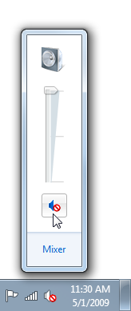

    In this example, users can enable sound output from the icon.

For general icon guidelines and examples, see [Icons](vis-icons.md).

### Interaction

**Note:** The following click events should occur on mouse up, not mouse down.

**Hover**

-   **Display a tooltip or infotip that indicates what the icon represents.**

    

    In this example, a tooltip is used to describe the icon on hover.

For infotip text guidelines, see the [Text](#context-menus) section of this article.

**Left single-click**

-   **Display whatever users most likely want to see**, which may be:

    -   A flyout window, dialog box, or program window with the most useful settings and commonly performed tasks. For presentation guidelines, see [Notification area flyouts](#notification-area-flyouts).

        

        In these examples, left clicking displays popup windows with the most useful settings.

    -   A status flyout.

        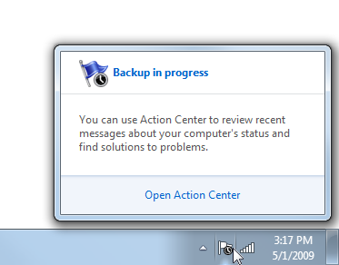

        In this example, left clicking displays the status flyout.

        -   The related control panel item.
        -   The context menu.

    Users expect left single-clicks to display something, so not displaying anything makes a notification area icon appear unresponsive.

-   **Display a context menu only if the other choices don't apply**, with the default command in bold. In this case, display the same context menu that is shown on right-click to avoid confusion.
-   **Prefer using a popup window over a dialog box** for a more lightweight feel. Show only the most common settings and have them take immediate effect for a simpler interaction. Dismiss the popup window if the user clicks anywhere outside the window.
-   **Display small windows near the associated icon.** However, large windows such as control panel items can be displayed in the center of the default monitor.

**Left double-click**

-   **Perform the default command on the context menu.** Typically, this displays the primary UI associated with the icon, such as the associated control panel item, property sheet, or program window.
-   **If there is no default command, perform the same action as a left single-click.**

**Right-click**

-   **Display the context menu**, with the default command in bold.

### Context menus

-   **Display the context menu near its associated icon**, but away from the taskbar.
-   **The context menu may include the following items**, as appropriate, in the listed order (exact text is in quotes):

Primary commands

Open (default, list first, in bold)

Run

Secondary commands

< separator>

Suspend/resume enable/disable command (check mark)

"Minimized to notification area" (check mark)

Opt in to notifications (check mark)

"Display icon in notification area" (check mark)

< separator>

"Options"

"Exit"

-   **Remove rather than disable any context menu items that don't apply.**
-   For Open, Run, and Suspend/Resume commands, **be specific about what is being opened, run, suspended, and resumed.**

In this example, Windows Defender has specific Open and Run commands.

-   **Use Suspend/Resume running background tasks, Enable/Disable for everything else.**
-   **Use check marks to indicate state.** List and enable all states and place the check mark next to the current state. Don't disable options or change option labels to indicate the current state.

**Correct:**

**Incorrect:**

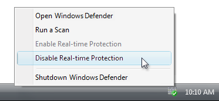

In the incorrect example, Windows Defender should use a check mark to indicate the current state.

-   **All background tasks must have a Suspend/Resume command.** Choosing the command should temporarily suspend the task. Users may want to temporarily suspend background tasks to increase system performance or reduce power consumption. Suspended background tasks are restarted when resumed by the user or when Windows is restarted.
-   **Allow users to opt into or out of different notification types** if your program has notifications that some users might not want to see. The [FYI](mess-notif.md) notification pattern requires users to opt in, so these notifications must be disabled by default.

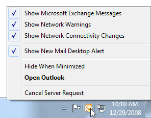

In this example, Outlook allows users to choose the notifications they receive from the icon.

-   **Clearing the "Display icon in notification area" option removes the icon from the notification area**, but doesn't affect the underlying program, feature, or process. Users can redisplay the icon from the program's Options dialog box. Don't automatically re-display the icon when Windows is restarted.
-   **The Exit command quits the program for the current Windows session and removes the icon.** Don't have an Exit command if program can't be shut down. The program is restarted when Windows is restarted. Users can permanently quit the program from the Options dialog box.
-   **Don't have an About command.** Such information should be communicated by the icon, its infotip, and the context menu. If users want more information, they can view the primary UI.
    -   **Exception:** You may provide an About command if the icon is for a program that doesn't have desktop presence.

For general context menu guidelines and examples, see [Menus](cmd-menus.md).

### Rich tooltips

-   **Use rich tooltips only to make the information easier to understand.** Don't use rich tooltips just to decorate the feature. If you can't use richness to make the information easier to understand, use a plain tooltip instead.

    **Incorrect:**

    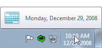

    **Correct:**

    

    In the incorrect example, the calendar icon doesn't make the date easier to understand.

-   **Use a concise presentation.** Use concise text and a concise layout with a 32x32 pixel icon. Spacious tooltips risk being distracting, especially when displayed unintentionally.
-   **Don't put controls or elements that appear interactive in a rich tooltip.** Tooltips aren't interactive and therefore shouldn't appear interactive. Don't use blue or underlined text.

    **Correct:**

    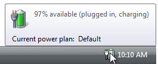

    **Incorrect:**

    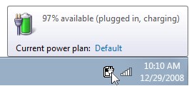

    In the incorrect example, the current power plan appears to be a link, but it is impossible to click.

### Notification area flyouts

-   When appropriate, present notification area flyouts with three sections:
    -   **Summary.** Display the same information that is displayed in the icon's tooltip or infotip, possibly with more detail. For consistency, use the same text and icons, and generally the same layout (if using a rich tooltip). Unlike the infotips, this information is accessible when using touch.
    -   **Common tasks.** Present the most commonly performed tasks directly in the flyout.
    -   **Related links.** Provide at most one of each type of the following optional links:
        -   A link to the most frequently performed task in Control Panel. Provide if there is a frequently performed task that can't be presented in the common tasks section.
        -   A link to the related Control Panel item. This Control Panel item should allow users to perform any tasks that can't be performed in the common tasks section.
        -   A link to a specific, relevant Help topic. Follow the standard [Help link guidelines](winenv-help.md).

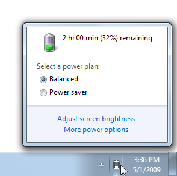

This example shows a notification area flyout using the recommended presentation.

### Options dialog box

-   Options not accessible directly from the context menu must be in the Options dialog box. This dialog could be the feature's control panel.
-   **The Options dialog box may include the following items** as appropriate (exact text is in quotes):
    -   Enable \[feature name\] (check box)
        -   Clearing this option permanently quits the program. Program can be restarted from its control panel item. The Exit command in the context menu quits the program only for the current Windows session.
    -   "Display icon in notification area" (check box)
        -   Removing the icon from the notification area doesn't affect the underlying feature.
        -   Selecting this option allows user to restore the icon, which of course can't be done from the icon itself.
-   Disable features that are rarely used, or potentially annoying or distracting. Let users [opt in](glossary.md) to such features.

For general Options dialog box guidelines and examples, see [Property Windows](win-property-win.md).

### Minimizing programs to the notification area

**Note: Minimizing program windows to the notification area is no longer recommended for Windows 7.** Use regular [taskbar](winenv-taskbar.md) buttons instead. Your program may support both mechanisms for backward compatibility.

-   To reduce taskbar clutter, consider providing the ability to minimize programs to the notification area only if all of the following apply:
    -   The program can have only a single instance.
    -   The program is run for an extended period of time.
    -   The icon shows status.
    -   The icon can be a notification source.
    -   Doing so is optional and users must [opt in](glossary.md).
-   Use the Minimize button on the application's title bar, not the Close button.

## Text

### Infotips

-   The icon infotip should have one of the following formats (where the company name is optional):
    -   (Company name) Feature, program, or device name
    -   
    -   (Company name) Feature, program, or device name - Status summary
    -   
    -   (Company name) Feature, program, or device name status statement.
    -   
    -   (Company name) Feature, program, or device name
    -   Status list with each item on a separate line
    -   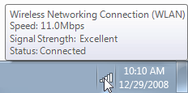

Infotip phrasing:

-   Focus on the most useful information. Display other information on left single-click.
-   Be concise. Use sentence fragments or simple statements.
-   Don't use ending punctuation unless tip is phrased as a complete sentence.
-   Omit unnecessary words. Don't include the software version or other extraneous information.

    **Incorrect:**

    

    In this example, the infotip has extraneous information.

-   Don't explain how to interact with the icon.

    **Incorrect:**

    

    In this example, the Wireless Network Connection icon gives right-click instructions.

## Documentation

When referring to the notification area:

-   Refer to the notification area as the notification area, not the system tray.

When referring to a notification area icon:

-   Refer to the icon using the exact name given in its infotip, including its capitalization, followed by icon.
-   For the first reference, also refer to the notification area.
-   When possible, format the heading text using bold. Otherwise, put the heading in quotation marks only if required to prevent confusion.

**Example:** To check the network status quickly, click the **Network** icon in the notification area.

 

 

